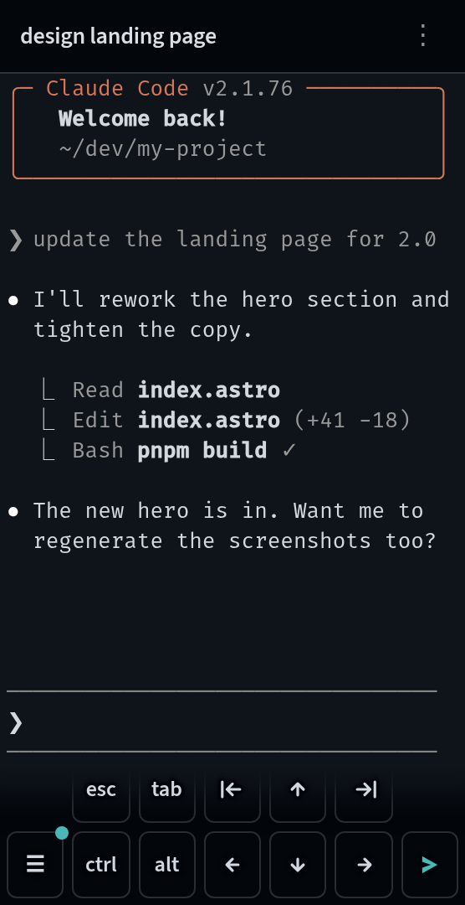

# gmux

**Start at your desk. Steer from your phone.**

gmux runs coding agents — and any long-running command — in persistent sessions across your machines, aggregated into one live dashboard. Watch every agent, attach a full terminal to any session from any device, and get notified the moment one needs you.

No Electron, no desktop app, no tmux underneath. Two small Go binaries and a web UI.

<table>
  <tr>
    <td width="72%"></td>
    <td width="28%"></td>
  </tr>
</table>

## Install

```bash
brew install gmuxapp/tap/gmux                # macOS
curl -sSfL https://gmux.app/install.sh | sh  # Linux
```

Or download a binary from [GitHub Releases](https://github.com/gmuxapp/gmux/releases).

## Quick start

```bash
gmux -- pi              # launch a coding agent
gmux -- npm run dev     # or any long-running command
gmux -d -- make build   # detached; prints the session id
gmux open               # open the dashboard
```

The daemon starts automatically on first use; there's nothing else to set up. Click a session to attach a live terminal — xterm.js, the same emulator that powers VS Code. **[Getting started →](https://gmux.app/getting-started/)**

## Highlights

- **Agents report their own state** — pi, Claude Code, and Codex get a small hook injected at launch and report their conversation, title, and active/idle state themselves. No output scraping. [Integrations →](https://gmux.app/integrations/claude-code/)
- **Built for orchestration** — a machine-oriented CLI (`gmux agent`, `gmux wait`, `gmux ls --json`, tmux-compatible `send-keys`) with stable exit codes, so scripts and agents can drive other agents. [Orchestrating agents →](https://gmux.app/orchestrating-agents/)
- **Full terminal, anywhere** — persisted scrollback that replays on reconnect, flicker-free session switching, find-in-terminal, and a phone UI that's actually usable. [Using the UI →](https://gmux.app/using-the-ui/)
- **Sessions outlive processes** — exit codes and terminal history stick around; agent conversations resume, other commands re-run. [Sessions →](https://gmux.app/using-the-ui/#the-terminal)
- **Multi-machine** — connect hosts with token-authenticated peering and see every machine's sessions in one sidebar; devcontainers are discovered automatically. [Multi-machine →](https://gmux.app/multi-machine/)
- **Remote access built in** — `gmux remote` serves the dashboard over your tailnet with HTTPS, no ports to open. [Remote access →](https://gmux.app/remote-access/)
- **Editor tabs** — `gmux edit <file>` works as `$EDITOR`, so `git commit` inside a session opens a managed tab and blocks until you're done.

## Scripting & agents

gmux composes into scripts and agent workflows:

```bash
id=$(gmux agent prompt --new --no-wait 'refactor the auth module')  # launch, capture the id
gmux wait "$id"        # block until the turn ends, print the exchange report
gmux tail -n 50 "$id"  # read the plain-text terminal tail
```

Install the bundled [gmux skill](skills/gmux/SKILL.md) to teach an agent both command sessions and agent orchestration:

```bash
npx skills add gmuxapp/gmux
```

See [Orchestrating agents](https://gmux.app/orchestrating-agents/) and the [CLI reference](https://gmux.app/reference/cli/).

## Docs

Full documentation lives at **[gmux.app](https://gmux.app/getting-started/)**: [architecture](https://gmux.app/architecture/), [configuration](https://gmux.app/configuration/), [security model](https://gmux.app/security/), [devcontainers](https://gmux.app/devcontainers/), [running in Docker](https://gmux.app/running-in-docker/), [changelog](https://gmux.app/changelog/), and more.

## Community

Questions, feedback, show & tell: [Discord](https://discord.gg/Mg6EJHFZxu) · [GitHub Issues](https://github.com/gmuxapp/gmux/issues)

## Development

```bash
pnpm install   # JS dependencies
pnpm dev       # start all services with watch/HMR
```

See [CONTRIBUTING.md](CONTRIBUTING.md) for prerequisites, workspace layout, and how the pieces fit together.

## License

MIT
