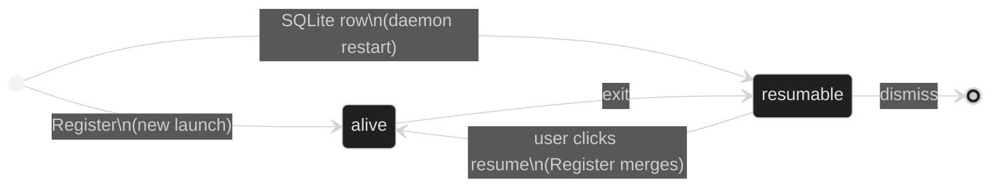

Session state flows one way: runners (and their agent hooks) produce it, `gmuxd` aggregates it in a store, and the frontend renders it. The frontend never modifies session state — it sends actions and waits for the backend to broadcast the result.

## The store

`gmuxd` holds all daemon-owned structured state in a single SQLite database (`~/.local/state/gmux/state.db`, ADR 0026). Every domain mutation commits to SQLite before any snapshot invalidation or side effect is published. The database is the authoritative source for sessions, projects, peers, and their relationships.

After a domain transaction commits, it signals a coalesced invalidation. gmuxd queries a complete snapshot from SQLite and sends `snapshot.sessions` and/or `snapshot.world` to connected browsers (protocol 2, ADR 0001). REST GET endpoints read from the store directly at request time (read-your-writes); SSE snapshots come from a coalesced composer cache.

### Schema changes

Released migrations are immutable. A schema change ships as a **new** migration
file; never edit a migration that has shipped. goose only records the migration
*version*, so editing one in place leaves an already-migrated database at that
version silently un-upgraded — the renamed or added column surfaces as a query
error at runtime instead.

gmuxd refuses to start against a `state.db` whose schema version is newer than
the embedded head, takes a backup before applying a pending migration, and runs
integrity and foreign-key checks afterwards. If you hit a broken development
database anyway (from editing a migration in place before it shipped), reset it
(stop gmuxd, remove `~/.local/state/gmux/state.db`). Live sessions are
runner-owned and re-register; the loss is dead-session history.

A byte-identical snapshot is detected in the composition path and never broadcast — this no-op dedup is load-bearing for the snapshot protocol. Cross-entity operations (registration + project assignment, dismissal + recursive placement removal, etc.) execute in one transaction.

### Local rows vs peer projections

Only local sessions live in the SQLite store. Sessions owned by a peer are an in-memory **connection projection**: the hub consumes the spoke's snapshot stream, namespaces the IDs (`id@peer`), and overlays the rows into outgoing snapshots without persisting them. Peer-resolved fields like `title` and `resumable` are trusted as-is — the spoke already resolved them authoritatively — and the projection disappears when the peer disconnects.

## Who writes what

Each field on a session has a single owner. No two subsystems write the same field.

| Transition | Owner | Trigger |
|---|---|---|
| Session appears (live) | **Register** | Runner calls `POST /v1/register` |
| Session reappears after restart (dead) | **SQLite row** | Persisted in `state.db`; survives restart by construction |
| Metadata updates | **Subscription** | Runner SSE `status` / `meta` events |
| Held file + title + status | **Agent hook** | runner SSE `conversation_file` / `status` events |
| Session dies (clean exit) | **Subscription** | Runner SSE `exit` event |
| Session dies (crash) | **Discovery Scan** | Socket file gone |
| Session hidden | **Dismiss** | User clicks × (recursive over launch descendants) |
| Activity stamp | **Store** | `last_output_at` when unread turns on (new unseen output) |

### Register: single entry point for live sessions

All live session creation flows through `Register()`. It queries the runner's `/meta` endpoint, creates or merges the session, and starts an SSE subscription. Both the `POST /v1/register` HTTP handler and the discovery scan delegate to it.

For resumed sessions, the daemon launches the runner with `--resume-id` (ADR 0003): the runner registers under the same session ID and `Register()` lands in its re-registration merge branch, which overwrites only runtime-owned fields and preserves slug, creation time, and the hook-reported title. Resume also preserves PTY size hints and falls back to the project's canonical folder when the original cwd is gone.

### Discovery Scan: consistency check, not session creator

Runners register themselves; the scan is a periodic fallback (every 30 seconds, plus once at startup) that does two things:

1. **New sockets** → delegates to `Register()` (never creates sessions directly)
2. **Missing sockets** → marks alive sessions as dead

This means discovery can never race with Register to create duplicate sessions.

### Agent hook: authoritative live state

Live session state is reported by the agent itself, not inferred by the daemon. The runner injects a gmux hook into the agent (`pi -e`, or codex/claude hooks), and the agent POSTs the held conversation, title, and status to the runner socket; the runner forwards them over SSE. `gmuxd` records the conversation's ref on the session (`ConversationRef`). A `/resume` rebind to a different conversation is just another report. Tools that can't be hooked run without daemon-reported live state — there is no metadata-matching fallback.

### Conversation sources: index updates

Separately, each file-backed adapter implements `ConversationSource` to keep the conversations index (URL resolution + search) current: a snapshot at startup, then incremental create/change/remove events via the shared `filewatch` watcher. This covers dead conversations that have no running session, which the hook path cannot.

### Dead-session persistence

Dead sessions survive daemon restarts because they are rows in the SQLite database. When a session exits, its state is committed to `state.db`; on startup gmuxd rediscovers surviving runners and merges their live state, then serves the first snapshot. There is no separate sweep or JSON file to synchronize.

Retention: adapters own resumability and retention policy. Each adapter reconciles its retained candidates and returns a disposition (retain, remove, or unknown); unknown retains conservatively, so rows are only removed when their adapter positively confirms the conversation is gone. Dead-session scrollback is a cache with an aggregate byte target. There is no periodic scan of adapter conversation directories creating sessions — that mechanism was retired; the conversations index handles dead-conversation URL resolution.

## Session lifecycle



**Key transitions:**

- **alive → resumable:** Subscription receives an exit event from the runner, or discovery finds the socket gone. A dead row is offered as resumable when it has evidence it actually ran, its adapter has not declared the conversation gone, and a resume command can be derived. The stored launch `command` is preserved; the resume command is derived from `(adapter, conversation_ref)` at resume time, not written back into the row.
- **resumable → alive:** User clicks the session. The resume handler spawns a runner for the existing session ID; when the runner registers, the coordinator merges it back to alive under the same identity.
- **resumable → dismissed:** Dismiss stamps `dismissed_at` and removes project placement — recursively across launch descendants. The row stays in SQLite, hidden, until adapter reconciliation removes it; it does not resurface across daemon restarts.
- **Editor sessions** (`gmux edit`) are an exception: they're dismissed automatically when the editor closes, never becoming resumable.

## Derived fields

These are computed by the daemon when composing snapshots, never set manually:

| Field | Derivation |
|---|---|
| `title` | `adapter_title` > `shell_title` > `CommandTitler` > adapter name |
| `resumable` | dead + ran-evidence + adapter has not declared the conversation gone + a resume command can be derived |
| `last_output_at` | stamped when `unread` turns on — the session produced output the user hasn't seen. Powers the activity feed's recency ordering |

Staleness (the "outdated" badge) is **frontend-derived**: the UI compares each session's `runner_version`/`binary_hash` against `/v1/health`. There is no `stale` store field.

**Title priority:** `adapter_title` always wins over `shell_title`. An empty `adapter_title` from the runner never overwrites a non-empty one on the daemon, preserving titles across resume where the daemon knows the title but the freshly-started runner doesn't yet. The next fallback is the adapter's `CommandTitler` interface (shell uses this to show `pytest -x`). The final fallback is the adapter name (e.g. "codex").

**Internal vs API-visible fields.** Several fields are internal to gmuxd and excluded from the API response via `MarshalJSON`. Their derived outputs are exposed instead. See the [field map](/develop/session-schema#field-map) for the full breakdown.

## Frontend architecture

The frontend is a projection of backend state. Session state arrives exclusively via `EventSource('/v1/events?session_stream=3')` (ADR 0001):

1. `snapshot.sessions.begin` / `.batch` / `.ready` — complete semantic rows are staged in bounded batches and replace the visible list atomically at ready. A `.error` diagnostic means one oversized row was omitted; the remaining epoch still becomes ready.
2. `snapshot.world` — projects, peers, health, launchers, and peer projects. It remains a separate protocol-2 full replacement; the 48 KiB session-event bound does not apply to world.
3. `session-activity` — bare `{id}` ping, lossy by design.

Reconnect discards unpublished staging and restarts from a leading-edge full replacement, so missed updates do not matter. Epochs increase strictly and the first accepted session protocol locks each transport against mixed-mode rollback. A quarantined row produces a persistent sidebar warning until a later clean bootstrap. Unversioned custom consumers and old tabs temporarily receive protocol-2 `snapshot.sessions`; `GET /v1/sessions` remains for the CLI and scripts.

Mutations use a bounded **optimistic overlay**: mark-read, dismiss, and reorder are stacked as pending mutations and replayed on top of incoming raw snapshots until the server echoes them back or a 5-second TTL expires. The UI feels instant, and a failed action self-heals back to server truth (plus an error toast).

### UI state (frontend-owned)

Two pieces of state are local to the frontend and not part of the session model:

```typescript
selectedId: string | null   // which session the terminal shows
resumingId: string | null   // which session has a resume in flight
```

**`selectedId`** — derived from the URL: selection *is* routing (`navigateToSession`). The view resolves only after both snapshots load, so a deep session URL survives a refresh.

**`resumingId`** — set when the user clicks a resumable session. Shows a pulsing dot on the sidebar row while waiting for the backend to confirm the session is alive. Cleared when the SSE upsert arrives with `alive: true` and a valid `socket_path`, or after a 10-second timeout.

### canAttach

The terminal renders when `selected.alive && (selected.socket_path || selected.peer)` is true. This means:

- Dead/resumable sessions: no live terminal — the replay view shows persisted scrollback with a Resume/Rerun action
- Alive but no socket yet: impossible for local sessions — `Register()` sets both `alive` and `socket_path` atomically; peer sessions have no local socket and attach through the hub proxy instead
- Alive with socket: terminal connects via WebSocket proxy

## Status

Status carries only granular booleans (`active`, `error`, `interrupted`) and is **null by default**. It describes *live* state; display text is the frontend's concern, derived from these plus `exit_code`.

| State | What the UI shows | Status field |
|---|---|---|
| Alive, idle | Steady dot | `null` |
| Alive, active | Pulsing dot + header "Working…" | `{ active: true }` |
| Alive, error | Red dot + header "Error" | `{ active: false, error: true }` |
| Dead, clean exit | Dimmed row, "Session ended" | `null` |
| Dead, non-zero exit | Dimmed row, "exited (N)" from `exit_code` | `null` |
| Resumable | Normal row, clickable | `null` |

Exit text (`exited (N)` / `Session ended`) is derived in the frontend from `exit_code`, not carried in Status. A reported terminal outcome (error/interrupted) is retained across death so `gmux wait` and reports can attribute the last turn's outcome.
