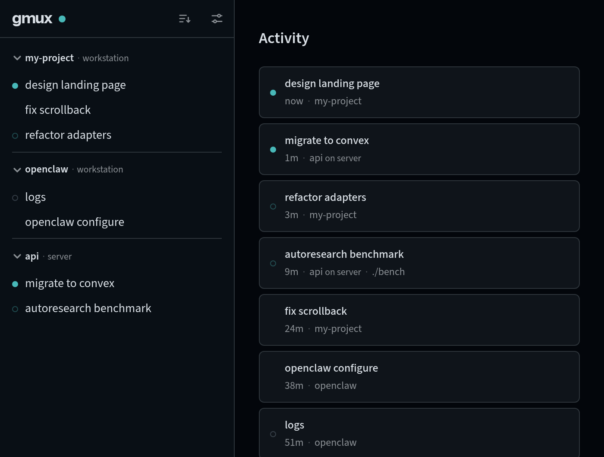

Running `gmux open` opens gmux in a dedicated browser window. You can also navigate to **[localhost:8790](http://localhost:8790)** directly; the first time you'll need to authenticate by visiting the login URL from `gmux auth`.

The **sidebar** lists your sessions, grouped into projects. Home is **Activity**: a feed of live sessions across all your hosts, ordered by last output and grouped by day. A session floats up only when it produces new output you haven't seen — status changes its dot, not its position — so the queue stays stable while you work down it. An **Enable notifications** pill in the Activity header opts this browser into notifications for turns that finish while you're elsewhere.

In the sidebar header, the **gmux logo** takes you home (it lights up when a session elsewhere is waiting on you), the **sort button** switches the sidebar between **Projects** and a flat **Activity** view — and can narrow the tab to one host or hide dead sessions — and the **sliders button** opens **Settings**.

## Your first project

A fresh sidebar is empty: gmux discovers sessions but never adds anything to the sidebar on its own.

The natural way to fill it: run a gmux command in the folder you work in (`gmux -- pi`), then open **Settings → Projects** — the directory is already waiting under **Discovered**, so adding the project is one click. You can also launch straight from the UI: a fresh install shows a single **+** button (which seeds a default *home* project), and once you have projects, hovering a project name reveals its **+**, with a menu of the agents installed on that host.

Projects match sessions by filesystem path or git remote URL. Projects on other machines aren't matched by rules — add them under **Settings → Projects → From other hosts** once the host is [connected](/multi-machine/).

The project's **+** menu also opens **Manage worktrees**. The sheet lists linked Git worktrees, creates branch-backed checkouts, and launches an agent in any checkout. Removal is deliberately conservative: gmux refuses primary, dirty, locked, or session-owning worktrees. The same local workflow is available as `gmux worktree current`, `gmux worktree ps`, and `gmux worktree create`.

## The terminal

Click a session to attach a full interactive terminal. **Cmd/Ctrl+F** opens find-in-terminal; the full default keymap and how to override it is in the [settings reference](/reference/settings/#default-keymap).

The **⋮** menu holds the lifecycle action — **Restart** for a live session, **Resume** or **Rerun** for a dead one — plus **Browse files**. The read-only file view stays scoped to the session workspace, previews text and images, and can open paths recognized in terminal output without unmounting the terminal. Dead sessions replay their terminal history read-only: resuming continues an agent conversation where it left off, rerunning starts the command fresh in the same directory.

To get rid of a session, hover it in the sidebar and click **×**. This stops the session **and every session it launched**, then removes them from the UI — but it isn't data deletion: agent conversations stay in their own tools, and terminal history is kept until gmux eventually cleans it up.

## Session families

Sessions launched by an agent — subagents, test runners, watchers — group **under that agent** in the sidebar: one root row stands in for the whole family, with a counts line for what its members are doing and a family panel (the pill next to the session title) mapping the full tree. Viewing a member shows its ancestry as breadcrumbs in the header.

When a child grows into work you track in its own right, open its **⋮** menu and choose **Promote to root**. The session gets its own sidebar row — placed by its own directory, like any root, so it needs a project that contains that directory (if none does, the menu item says so and stays unavailable until you add one). Its waiting/error states then surface on its own row instead of the family roll-up, and its subtree gets its own [active-subagent budget](/reference/host-toml/). Promotion is a real move, not a display trick: the session leaves the family, so **×** on the former parent no longer stops or removes it, and future unread output is no longer held back while that parent works — a root answers to nobody. A turn that already finished quietly under a busy parent is not re-announced when promoted. Who launched what is still recorded, which is how the same menu can offer **Return to family**: it moves the session back under the agent that launched it, and is available while that family root has a project-backed sidebar row; if that root is outside every project, the item stays visibly unavailable until you add one. A session launched top-level has no recorded launch parent, so after reparenting it elsewhere and promoting it the menu cannot offer **Return to family**; `gmux reparent` still works when you know the target ID. Both actions are available only on the host that owns the session, and from the CLI as [`gmux promote`](/reference/cli/#gmux-promote-id) and [`gmux reparent`](/reference/cli/#gmux-reparent-id-parent-id).

## On your phone

Open the same URL on your phone — or from anywhere via [remote access](/remote-access/). The sidebar slides in from the left (tap **☰**), and a bottom toolbar supplies the keys phones don't have: esc, tab, arrows, word-jump, and send. **ctrl** and **alt** arm for the next key — tap **ctrl**, then `c`, for Ctrl+C. Long-press a link in the terminal to copy or open it.

## Next steps

- **[Orchestrating agents](/orchestrating-agents/)** — launch agents from scripts or other agents, prompt them, and harvest their results.
- **[Devcontainers](/devcontainers/)** — one line in `devcontainer.json` and container sessions appear alongside everything else.
- **[Remote access](/remote-access/)** — reach gmux from your phone or another machine over your tailnet.
